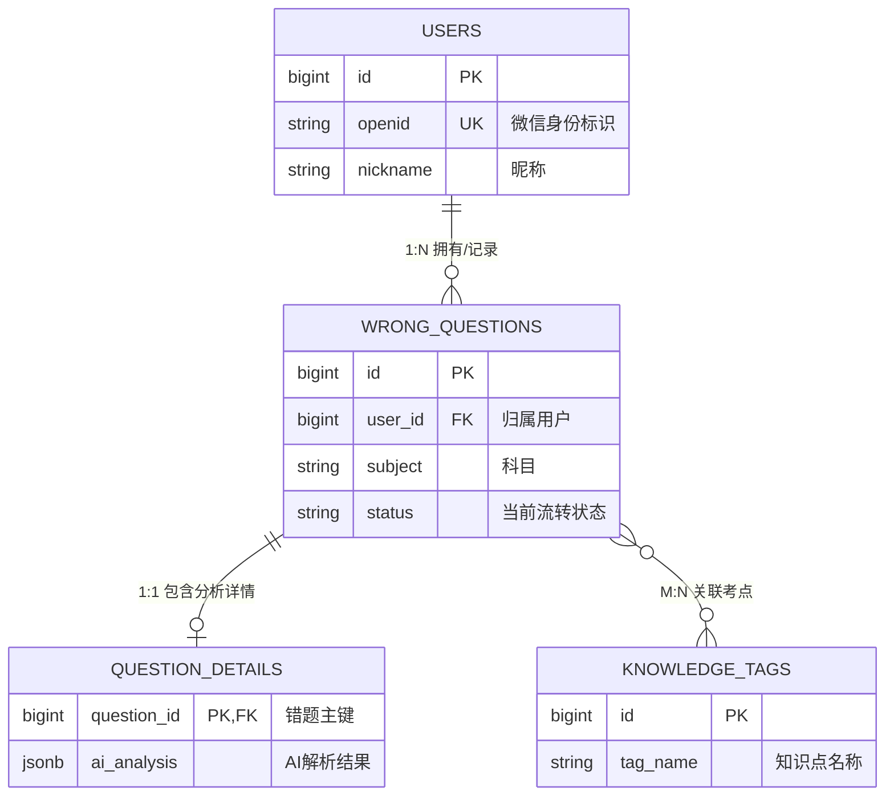

# 数据模型与业务契约架构设计模板 (Data Architecture & Business Contract Template)

> **文档说明**：本模板旨在规范项目的数据模型设计，采用“金字塔”递进结构，不仅涵盖基础的数据库表结构定义（Data Schema），更强调**数据操作逻辑 (Data Logic)** 和 **数据验证逻辑 (Validation Logic)**。它的目标是使得数据文档不再是“死的DDL方案”，而是具备“生命力”，并作为支持前后端开发交付的**核心业务契约 (Business Contract)**。

---

## 设计理念：数据架构金字塔模型
该模板采用“金字塔”递进式结构，实现“向下夯实底层性能，向上支撑前后端开发契约”：
1. **顶层：核心实体与边界** - 解决“存什么”，明确宏观业务隔离。
2. **中上层：字段级业务契约** - 解决“怎么定规矩”，指导前端表单校验与后端入参校验。
3. **中下层：数据操作与流转逻辑** - 解决“怎么查、怎么写”，制定状态机与业务触发器规则。
4. **底层：索引与扩展性架构** - 解决“怎么快、怎么存”，制定分离策略与性能保障机制。

---

## 1. 顶层：核心实体定义与边界划分 (Business Entities & Boundaries)
> [!NOTE]
> **【章节用途与开发指南】**：本章节定义了宏观架构蓝图。AI 助手或架构师可通过本章节提取**领域驱动设计 (DDD)** 中的**聚合根 (Aggregate Roots)** 与实体边界。它指导了开发团队明确哪些模型之间绝对不能使用物理外键制约，并为跨服务解绑时的级联安全策略提供判断依据。

### 1.1 核心实体梳理与 ER 图 (Entity-Relationship Diagram)
> **【章节用途与开发指南】**：本节用于**全局业务扫盲与依赖摸底**。AI 需通过分析此图，识别出业务核心主线，提取各个实体的关联维度。在生成代码时，利用此图形态判断出核心领域的**聚合根 (Aggregate Root)**，并决定底层的 Entity 框架关联关系设计。
*(要求：使用 Mermaid 语法绘制核心业务流的实体关系图，直观展示业务数据拓扑。)*

### 1.2 实体与关系解析 (Entity & Relationship Descriptions)
> **【章节用途与开发指南】**：本节聚焦于**级联安全与物理边界拆分**。指导 AI 在生成删除接口（Delete API）时，必须严格参考此表的“级联与删除边界”。若标明“严禁硬删”，AI 生成逻辑必须强制转换为 `update is_deleted = 1`；若标示“独立存储架构”，AI 生成的查询映射则必须对其进行防级联污染的物理隔离。
*(要求：用一个统一的表格，详细描述 ER 图中每个实体的业务定位、存储的内容数据，以及与其他实体之间的关系架构映射)*

| 实体名 (Entity) | 业务定位与存储内容 (Business Role & Data Stored) | 核心关系映射 (Logic Relations) | 级联与删除边界 (Cascade Settings) |
| :--- | :--- | :--- | :--- |
| **`users`**   (用户实体) | **业务主权核心**。存储来自微信生态的 `openid`、会话身份及基础资料。所有的私域业务均以此为主权边界，保障数据隔离。 | **1:N** 记录 `wrong_questions` | **绝对禁止物理外键**。若账号注销，需对其归属资料做脱敏匿名化，而非全量物理删除。 |
| **`wrong_questions`**   (错题单据主体)| **系统核心骨干表**。为保障 C 端列表页高频拉取的性能，该表只存基础维表 ID、状态机(`status`)和轻量级筛选维度(`subject`等)。 | **N:1** 归属于 `users`   **1:1** 包含 `question_details`   **M:N** 关联 `knowledge_tags` | **严禁硬删除**，系统必须统一拦截采用逻辑删除(`is_deleted`)。 |
| **`question_details`**   (错题信息扩展)| **重资产信息承载表**。通过垂直拆分，专门存放错题相关的庞大文本数据（如 OCR 解析原文、AI 长副文本解析 `analysis`）。 | **1:1** 强依附于 `wrong_questions` | 主表发生逻辑删除时，详情表依靠相同的筛选器屏蔽查询，无需冗余软删除标志。 |
| **`knowledge_tags`**   (知识点主数据)| **类目字典结构**。构建学科类目体系，存储用于后期做试题推荐、图谱打标分析的基础元数据。 | **M:N** 被 `wrong_questions` 挂载 | 基础主数据，通常不允许业务侧直接做物理删除。 |

*(实际落地团队编写时，请根据真实架构替换为你的图表及实体表单)*

---

## 2. 具体实体数据模型设计 (Entity Data Models)
> [!IMPORTANT]
> **【章节用途与开发指南】**：前后端对接的核心开发契约区！这一章的精髓在于**建立“字段级生命周期与重计算矩阵”，这直接指导开发团队建立 Controller 和 Service 层的 DTO 防火墙**。
> 例如：开发人员或 AI 代码助手在编写 `GenericUpdateRequestDTO` 时，必须核对本章的【变异权限生命周期】。若字段标示为“不可变”或“仅内部逻辑推导”，则严禁将其暴漏给前端通用更新接口，必须通过代码策略被强行屏蔽或丢弃！

### 2.1 核心业务实体定义 (Entity Definition)
> **【章节用途与开发指南】**：这是代码安全防线建立的**最高指令大纲**。AI 在生成 Controller 接收层和 Service 校验层代码时，**必须且只能以本生命周期矩阵为唯一事实依据**。凡标明“绝对不可变”的字段，必须在相关更新接口层面予以拦截清除；凡挂载防御要求的字段，后端的 `@Valid` 或验证器函数必须被 1:1 精确复刻到实战代码中。

*   **表结构基础属性**:
    *   **字段配置**: 明确 `字段名`, `类型`, `非空` 以及 `默认值`。这是给 DBA 或 AI 自动生成建表 DDL 的基准。
    *   **字段含义**: 对核心字段进行人类可读的字典级释义。
*   **核心作用与架构约束 (Core Role & Validations)**：
    *   **【关键】** 不仅描述字段有什么作用，更必须在“核心作用”列中强制集成**两大防线规则**，指导开发人员规避高危漏洞：
        1. **变权规则 (Mutation)**：谁能改？是前端放行、系统自动推导，还是只能走底层原子操作？指导 DTO 如何过滤参数。
        2. **验证防线 (Validation)**：前后端要加什么拦截器？比如 `@Valid` 正则匹配、前端禁用提交按钮及标准的报错兜底文案。

**【规范示例：核心业务业务实体防线表 (以错题主表为例)】**
| 字段名 | 类型 | 非空 | 默认值 | 字段含义 | 核心作用 (含变异权限与防御规则) |
| :--- | :--- | :--- | :--- | :--- | :--- |
| `id` | `bigint` | Y | 自增 | 单据主键ID | 全局业务隔离根。 **【变异权】**: 绝对不可变。 **【验证防线】**: 查改必定严格携带，精确透传校验。 |
| `user_id` | `bigint` | Y | - | 关联用户外键 | 租户级数据隔离强约束。 **【变异权】**: 绝对不可变。 **【验证防线】**: 必须由后端网关/全局上下文自动装填，彻底拒收并忽略前端的透传视图。 |
| `subject` | `varchar(50)` | Y | - | 所属科目 | 核心题库维度划分依据。 **【变异权】**: 允许前端表单新建与修改。 **【验证防线】**: 前端必须部署限权下拉组件阻断手输方案；后端强制附加 `@NotNull, @InEnum` 校核；抛出“未知的科目范围”异常。 |
| `status` | `varchar(20)` | Y | 'INIT' | 当前流转状态 | 标明单据生命周期时序(`INIT -> ANALYZING -> COMPLETED`)。 **【变异权】**: 落库后严禁通用更新，仅高特权内部流转触发。 **【验证防线】**: `UpdateDTO` 直接抹除该字段暴露，发现前端携带此伪造状态参数即抛出 `403` 强行阻断。 |
| `review_count`| `int` | N | 0 | 历史复习频次 | 测算试题掌握度的数据基准。 **【变异权】**: 仅限于系统内部底层触发 DB 原子自增指令 (`count ++`)。 **【验证防线】**: 通用控制层直接利用 `@Null` 强力过滤该属性注入，严防前端以接口造假刷分。 |
| `analysis` | `jsonb` | N | - | AI结构化解析 | 重资产核心 AI 评分依据与结果承载。 **【变异权】**: 仅允许经由特定的第三方 AI 异步回调接口实现改写填槽。 **【验证防线】**: 入库时启用高要求 Schema 组件防止写入结构崩盘；要求大前端装配相关内容拉取失败/格式损坏时的备用降级 UI 组件防全局雪崩。 |

### 2.2 关系与基数定义 (Relationships & Cardinality)
> **【章节用途与开发指南】**：指导 AI 构建**多表组装查询策略**。当需要开发连表详情接口时，AI需查看此处的“基数映射”，决定在组装 VO (View Object) 时是用 List 结构还是单一属性接收实体参数，并根据这层的约束决定底层是采用逻辑外键业务层组装，还是采用视图直连操作。

*   **一对一 (1:1)、一对多 (1:N)、多对多 (M:N)**：比如“用户”和“错题本记录”是一对多，“单题记录”和“知识点库”可能是多对多挂载。
*   **外键或逻辑关联**：在现代微服务或高性能单体架构中，经常放弃物理外键以追求插入效率，但在本设计文档中必须明确指出**逻辑外键**的对应关系（如明确 `question.user_id` 关联的是 `users.id`）。
*   **级联行为 (Cascade Behaviors)**：例如当发生用户注销这种动作时，他的庞大错题记录是采用硬删除（Hard Delete）、软删除（Soft Delete），还是匿名化处理？通常建议全部采用软删结构或通过 `user_id = 0` 进行剥离。

**【规范示例：明确到子集关系及防丢失机制】**
| 本位实体 | 关联实体 | 映射基数 | 物理 vs 逻辑映射关系 | 事件级联安全防范 (Cascade Behaviors) |
| :--- | :--- | :--- | :--- | :--- |
| `users` | `wrong_questions` | 1:N | 逻辑关联 (`question.user_id = users.id`) | 避免硬删级联。主账号注销，采用系统内匿名化机制，将内容转化为无主公有数据集以供分析。 |
| `wrong_questions` | `question_details` | 1:1 | 逻辑关联 (`details.question_id = main.id`) | 典型的垂拆表。通过业务代码实现主表与详情表的统一同步软删机制（`is_deleted=1`）。 |

### 2.3 系统级元数据规范 (System Metadata)
> **【章节用途与开发指南】**：用于标准化**系统级切面行为 (AOP)**。指导 AI 在搭建项目脚手架时，能自动预先为所有实体类注入包含这批字段的 `BaseEntity` 父类。并提示自动生成基于框架的生命周期拦截器（例如自动拦截 SQL 并填充 `created_at`、`updated_by` 的公共过滤器钩子代码），而非要求在每次业务中手动赋值。
> 这是一个标准安全表的基石挂组件：
* `id` : 主键（推荐使用雪花算法生成的分布式ID 或 UUID/BIGSERIAL）。
* `created_at` (`TIMESTAMP DEFAULT CURRENT_TIMESTAMP`) : 数据创建时间。
* `updated_at` (`TIMESTAMP`) : 最后修改时间，通常结合 DB 触发器或后端框架进行覆写。
* `created_by` / `updated_by` (`BIGINT`) : 发生操作的追溯人员依据。
* `is_deleted` (或 `deleted_at`) : 软删除标记，推荐 `BOOLEAN NOT NULL, DEFAULT 0`。
* `version` (`INT DEFAULT 0`) : 应对高并发竞争更新场景的乐观锁防覆盖字段。
---
### 2.4 索引策略与查询优化 (Indexing & Query Optimization)
> **【章节用途与开发指南】**：决定**数据检索的生死防线**。AI 或开发人员在产出对应的 DAO/Mapper 层的 SQL 脚本时，必须核对查询条件设计是否撞击了本节所设定的“特许索引”。未经此节显式的索引授权支持，严禁为高频接口直接开放自由组合的扫表级连条件逻辑。

*   **主键索引**：默认标配。
*   **唯一索引**：防止脏数据及高并发插入冲突（例如限定微信用户的 `openid` 为唯一键）。
*   **普通/组合索引**：这需要强依赖**前端的查询场景**来逆向设计。
    *   *业务场景*：前端常常需要按“科目+时间”筛选“我的错题”列表。
    *   *设计推断*：因此，必须为主表追加一个组合索引 `INDEX(user_id, subject, created_at)`。如果没有针对前端高频查询配套索引，表数据一膨胀，系统必将面临全面崩溃。

### 2.5 字典值与枚举流转管理 (Dictionary & Enum Mappings)
> **【章节用途与开发指南】**：主导系统中的**强类型防护网架构**。AI 在审阅后应当立即为系统批量生成统一的标准化 `Enum` 类体系，且必须利用拦截器杜绝一切在业务分支判定中使用硬编码“魔法字符串”(Magic Strings) 的做法，从代码层面建立极高扩展性的分支路由防线。

*   **所有状态机的流转法则**：如错题状态，不仅要有固定的枚举值，还必须要明确说明**允许的跃迁路径**（例如：只允许由 `ANALYZING` 跳转至 `COMPLETED` 或 `FAILED`，禁止跳回 `INIT`）。
*   **字典表的落地方式**：必须标示清楚该业务域下的选项（如：科目分类），是准备走动态配置的通用字典表，还是在实体中直接进行静态硬编码枚举（Java Enum）。

---

## 3. 核心数据逻辑与业务支持 (Data Operation Logic)
> [!TIP]
> **【章节用途与开发指南】**：本章节指导的是“数据基座如何支撑并兜底表现层代码表现”。
> AI 或者开发人员阅览本节，能立即定位哪些操作必须被层层下防到**带原子锁特性的数据库处理中**，哪些大长文本检索必须附加**懒加载 (Lazy Load) 切面**避免把内存写废，并强行保证任何突发高峰与扫表活动都必须老实依照设计中安排的专属**组合索引与缓存设计**执行，杜绝拖垮核心交易库。

### 3.1 读写分离与存储策略 (Storage & Access Strategy)
> **【章节用途与开发指南】**：制定**复杂数据的系统级生存策略**。指导 AI 或开发人员在生成数据拉取 API 时，自动感知并排除需要“懒加载”的长大文本以防 OOM 事故；在面临高延迟长时数据落地链路（如 AI 分析结果）时，将原本串行的流程主动降群、切分入 MQ 或异步工作池线程异步闭环。

*   **同步 vs 异步落库**：比如错题图片上传后，是先生成一条状态为 `ANALYZING` 的记录存入 DB（同步操作），还是等 AI 分析完再把结构化结果一并写入（异步操作）？这决定了后端的 `Service` 层代码怎么写，以及怎么回冲数据。
*   **富文本/长大字段存储**：例如对于存储了 AI 复杂长文本结构结果的详细解析 (`analysis`)。模型设计里需注明：*“该字段建议采用懒加载（Lazy Loading），在列表页批量查询时默认严禁返回该字段（必须使用 `SELECT a, b, c FROM...` 排除此字段响应），仅当调用 `detail` 详情接口时才允许查询返回，以避免列表接口的带宽和内存溢出 (OOM)。”*

### 3.2 基于场景的核心业务计算规则 (Scenario-Driven Calculation Hooks)
> **【章节用途与开发指南】**：指导程序进行极高危**核心方法的防并发穿透设计**。如果 AI 试图生成此处提及的高危业务逻辑，则必须强制摒弃普通 CRUD 中的 `setXxx(...)` 的设值法则。不论发生何事，必须通过排他锁机制查后设、或是通过纯系 DB 级的并发自增语句来做防御隔离。

*   **常见场景 A：派生数值计算（例如：用户在前端点击“重新练习”，需要增加记录的复习打卡次数）。**
    *   *数据流转要求*：对于 `review_count` 这类的派生累加字段，**严禁**对其提供可供前端直传的赋值接口（例如禁止接收 API Body 传入 `{"review_count": 5}`）。
    *   *底层架构防御*：无论业务层怎么变迁，最终落地回库必须被设定为强制走数据库层面的原子累加指令（执行 `UPDATE table SET review_count = review_count + 1 WHERE id = ?`），以此彻底杜绝高并发下的脏写异常。
*   **常见场景 B：单据状态机跃迁（例如：AI 分析引擎处理错题图片完毕，并向后端触发完成回调）。**
    *   *数据流转要求*：这决定了主业务状态（`status`）能否合规闭环。绝不允许开发人员在 Service 层像修改普通字符串一样随意塞值。
    *   *底层架构防御*：
        *   **明示合法跃迁路径**：规定状态只能按特定时序流转，如 `INIT`(预处理) $\rightarrow$ `ANALYZING`(大模型运算中) $\rightarrow$ `COMPLETED`/`FAILED`(终态落地)。
        *   **明示退回与防篡改边界**：系统必须强制约定，一旦记录进入 `COMPLETED` 终态，需在 Controller 层直接拦截任何利用非法重发手段试图将业务强行拉回 `INIT` 开始前状态的危险请求。

### 3.3 查询访问模式 (Query Access Patterns)
> **【章节用途与开发指南】**：直接划定查询层面的**操作红黑榜单**。此节用以阻断违规生成动作：一旦 AI 检测到目标需求指向了宏大而复杂的库级全站统计查询（Dashboard），应当立即封锁主库权限获取请求，转为生成依赖于 Redis 等辅助高速缓存或是离线派生宽表的请求指令代码，保护数据库本体不被直接击穿。

*   **场景示例 A：核心高频热点拉取（如：用户查看自己的数学错题）。**
    *   *查询架构预期*：核心 SQL 需落实为 `SELECT * FROM wrong_questions WHERE user_id = ? AND subject = 'Math' AND is_deleted=0 ORDER BY created_at DESC LIMIT X, Y`。
    *   *底层架构要求*：针对此场景，文档必须约束数据库创建 `(user_id, subject, created_at)` 等组合连用索引以穿透支持，不容差池。
*   **场景示例 B：计算密集型大盘访问（如：统计全站某知识点的掌握率）。**
    *   *查询架构预期*：如果该查询耗时且属于扫表操作。
    *   *底层架构要求*：必须在契约中红字提醒后端开发，此类行为只准走离线汇总大表（宽表）或走中间件缓存（Redis）。**绝对禁止**任何类似直接面向高频前端网关开放并直连核心主库的操作。
